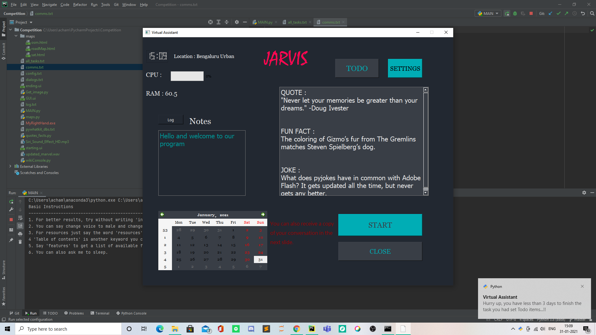
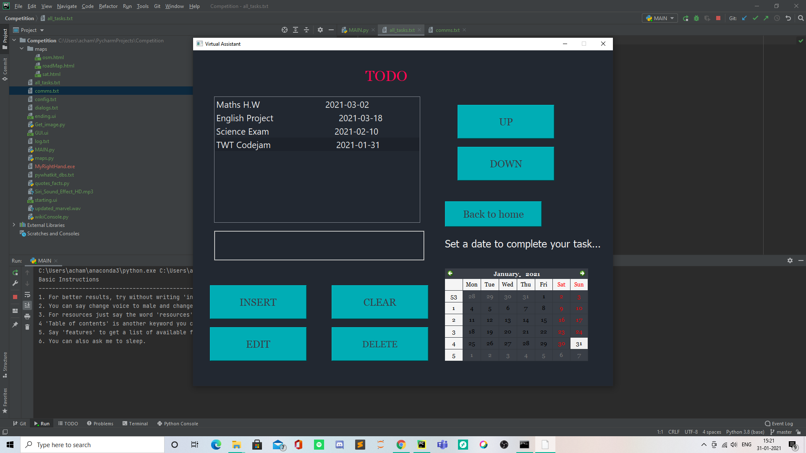
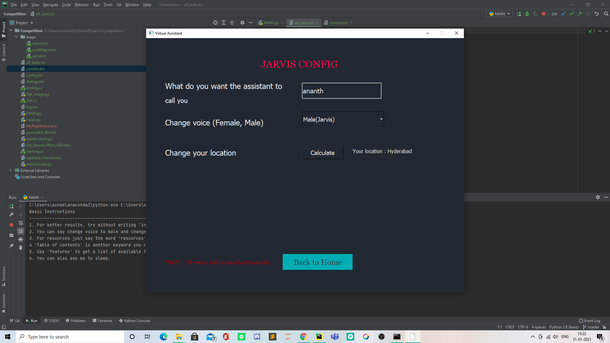
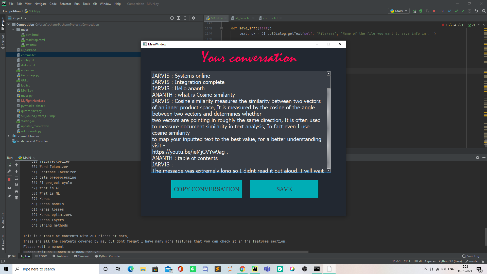

# MyRightHand

 This is a virtual assistant called MyRightHand. It has been made by team PHP_sucks. It is intended to be a bot that helps you in coding, by giving you a table of contents, which you can use to study study basic concepts.and it also answers a few basic coding questions, mainly related to AI and ML. But creating a bot only for answering coding problems would have been pretty boring, because of that we have added many other features, a few you can read about in the next section. Oh, and also this bot jelps in python coding questions specifically.

## More about this project

 It has a settings page which you can use to customize different things like your name and the voice of the assistant (Male and Female). It also calculates where your internet is coming from. These changes are automatically saved. It also has a built-in TODO application where you can insert items and set dates to complete them, delete items, edit items, clear items and prioritize your schedule. It also sends you notifications when there are only 3 days left to complete the task you had set. It also has features like writing notes and logging them, searching for things on google, youtube, quora and even wikipedia!! There is also a wiki console which shows you the text and a picture of what you searched for.
 There are also options like telling jokes, showing satellite maps and road maps and even showing fun facts and quotes. It can also carry out basic mathematical calculations and basic conversions.

## How to run the code
You can run the code by installing the exe file and then running the MAIN.py file inside it. If you find it difficult to run the program, you can watch our quick video on some basic functionality of our program.

## Some advanced features

This project also gives you resources and also has a list of features. Don't worry Tim I have mentioned your YT channel as a part of the video resources!!

